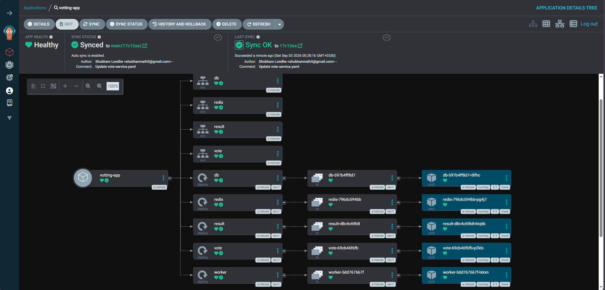
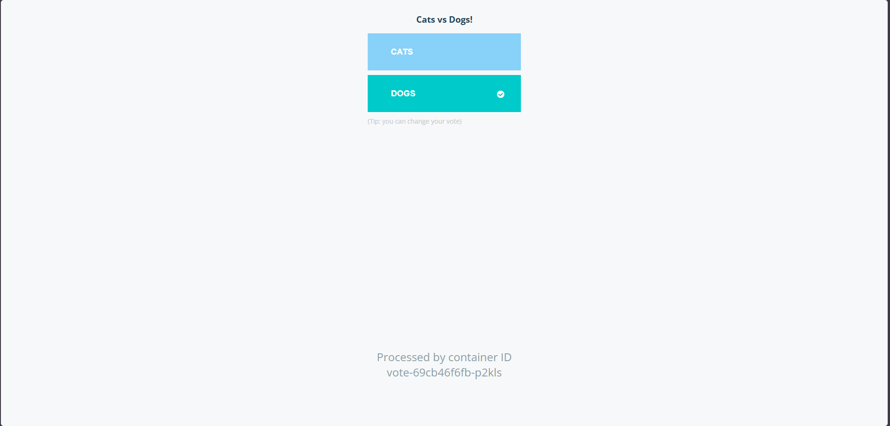
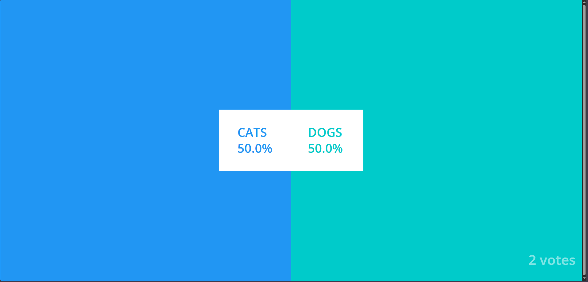
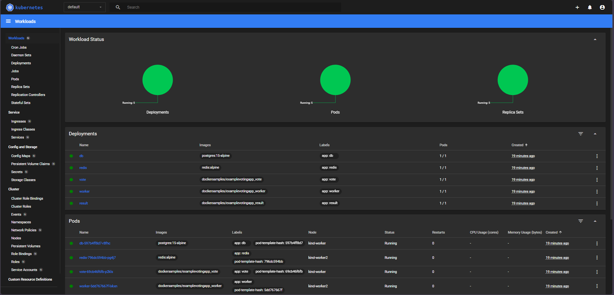

# AgroCD Kubernetes GitOps

Production-grade GitOps deployment pipeline using Argo CD for automated Kubernetes application delivery, featuring integrated custom dashboards for end-to-end cluster observability and real-time monitoring.

## Overview

This repository contains the manifests and configuration to deploy a sample Voting App to a Kubernetes cluster using Argo CD for GitOps-based continuous delivery. The project demonstrates:

- GitOps automation with Argo CD
- Kubernetes manifests (see k8s-specifications/)
- Local/test cluster setup using kind (see kind-cluster/)
- Custom dashboards for cluster and application observability

The deployed application is a simple voting app (vote + results) used to demonstrate multi-service deployments and automated rollout via Argo CD.

## Screenshots

Argo CD web UI showing application sync and health:

Application UI - voting page:

Application UI - results page:

Observability dashboards (Grafana / custom dashboards):

## How to use

1. Install a Kubernetes cluster (kind, minikube, or cloud cluster).
2. Install Argo CD into the cluster: https://argo-cd.readthedocs.io/
3. Point Argo CD to this repository (root or k8s-specifications/) as an application source.
4. Sync the application in Argo CD to deploy the voting app and supporting services.
5. Access the app (service URL / port-forward) and the dashboards (Grafana/Prometheus endpoints) as configured in the cluster manifests.

For exact manifests and setup steps, see the `k8s-specifications/` and `kind-cluster/` folders.

## Notes

- Filenames for screenshots are included at repository root. If you move them into a docs/ or images/ folder, update the README image paths accordingly.

---

Made with GitHub, Argo CD, and Kubernetes — automated GitOps delivery for a sample voting application with live dashboards.
